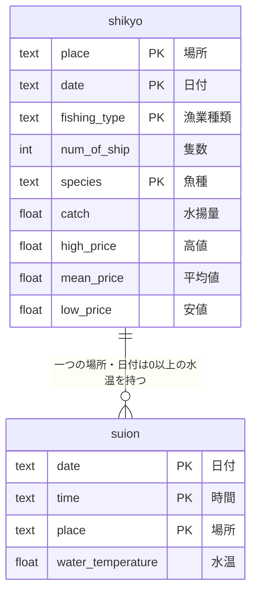

# ER図
---

```mermaid　
erDiagram
shikyo ||--o{ suion : "一つの場所・日付は0以上の水温を持つ"

  shikyo {
    text place PK "場所"
    text date PK "日付"
    text fishing_type PK "漁業種類"
    int num_of_ship "隻数"
    text species PK "魚種"
    float catch "水揚量"
    float high_price "高値"
    float mean_price "平均値"
    float low_price "安値"
  }

  suion {
    text date PK "日付"
    text time PK "時間"
    text place PK "場所"
    float water_temperature "水温"
  }
```